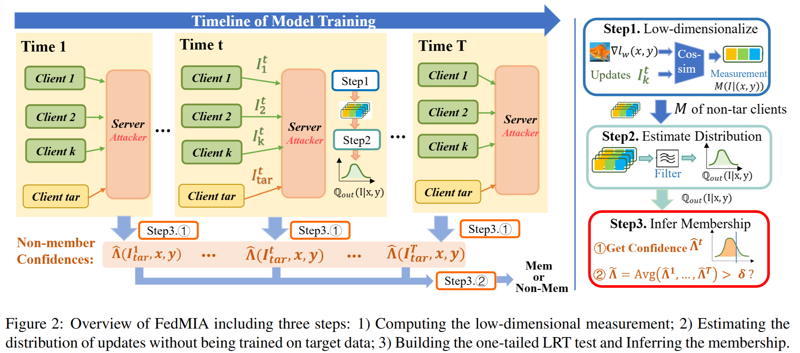

# FedMIA-Repository

### This is the official pytorch implementation of the paper:

- **FedMIA: An Effective Membership Inference Attack Exploiting  "All for One" Principle in Federated Learning**
- [Paper PDF in Arxiv](https://arxiv.org/pdf/2402.06289v2)

## Description

Federated Learning (FL) is a promising approach for training machine learning models on decentralized data while preserving privacy. However, privacy risks, particularly Membership Inference Attacks (MIAs), which aim to determine whether a specific data point belongs to a target client’s training set, remain a significant concern. Existing methods for implementing MIAs in FL primarily analyze updates from the target client, focusing on metrics such as loss, gradient norm, and gradient difference. However, these methods fail to leverage updates from non-target clients, potentially underutilizing available information.
In this paper, we first formulate a one-tailed likelihood-ratio hypothesis test based on the likelihood of updates from non-target clients. Building upon this formulation, we introduce a three-step Membership Inference Attack (MIA) method, called FedMIA, which follows the "all for one"—leveraging updates from all clients across multiple communication rounds to enhance MIA effectiveness. Both theoretical analysis and extensive experimental results demonstrate that FedMIA outperforms existing MIAs in both classification and generative tasks. Additionally, it can be integrated as an extension to existing methods and is robust against various defense strategies, Non-IID data, and different federated structures.

## Getting started

### Preparation

Before executing the project code, please prepare the Python environment according to the `requirements.txt` file. We set up the environment with `python 3.8` and `torch 1.8.1`.

In the experiment, we utilized two image classification datasets: [CIFAR-100](https://www.cs.toronto.edu/~kriz/cifar.html) and [Dermnet](www.dermnet.com). CIFAR-100 contains 50,000 images and 100 categories. Dermnet includes 23,000 dermoscopic images with 23 categories.

### How to run

#### 1. Basic Training under Federated Learning:
The basic command to run our repository is in `run.sh`. We provide two models, AlexNet and ResNet, based on the above two data sets. 

During model training, the Membership Disclosure Measure (MDM) information, i.e., **data loss, cosine similarity and gradient norm**, is saved for subsequent attack implementation.

#### 2. Attacks:

We conducted a comprehensive comparison of our methods, **FedMIA-I** and **FedMIA-II**, against six baseline attack methods: Blackbox-Loss[1], Grad-Cosine[2], Grad-Norm[3], Loss-Series[4], Avg-Cosine[2], and Grad-Diff[2]. FedMIA-I is utilizes the model loss measurement, while FedMIA-II employs the Grad-Cosine measurement.

The summary of these methods including the use of temporal and spatial information is shown in the below table:

|               | Measurement    | Temporal   Information | Spatial    Information |
| ------------- | -------------- | -------------------- | ------------------- |
| Blackbox-Loss [1]    | Data Loss      | Single               | Single              |
| Grad-Cosine [2]     | Cos Similarity | Single               | Single              |
| Grad-Diff [2] | Cos similarity | Single                | Single              |
| Grad-Norm [3] | Gradient Norm  | Single               | Single              |
| Loss-Series [4]    | Data Loss      | Multi                | Single              |
| Avg-Cosine  [2]   | Cos Similarity | Multi               | Single              |
| FedMIA-I Ours | Data Loss | Multi                | Multi               |
| FedMIA-II Ours  | Cos similarity | Multi                | Multi               |

These attacks are implemented in `mia_attack_auto.py` and the running command example is provided in `membership_attack.sh`. You will get a pdf format figure containing attack results after running it.

#### 3. Defenses

We evaluate the robustness of FedMIA against six defense methods, including Gradient Perturbation (Perturb) [5], Gradient Sparsification (Sparse) [9,10,11], MixUp [12], Data Augmentation [7], Data Sampling [8], and a combination of Data Augmentation + Sampling.

These defenses are controlled by the parameters in `utils/args.py`.

### References

1. Samuel Yeom, Irene Giacomelli, Matt Fredrikson, and Somesh
 Jha. Privacy risk in machine learning: Analyzing the connection to overfitting. In 2018 IEEE 31st computer security foundations symposium (CSF), 2018.

2. Jiacheng Li, Ninghui Li, and Bruno Ribeiro. Effective passive membership inference attacks in federated learning against overparameterized models. In The Eleventh International Conference on Learning Representations, 2022.

3. Nasr, Milad, Reza Shokri, and Amir Houmansadr. Machine learning with membership privacy using adversarial regularization. Proceedings of the 2018 ACM SIGSAC conference on computer and communications security. 2018.

4. Yuhao Gu, Yuebin Bai, and Shubin Xu. Cs-mia: Membership inference attack based on prediction confidence series in federated learning. Journal of Information Security and
Applications, 2022.

5. Robin C Geyer, Tassilo Klein, and Moin Nabi. Differentially private federated learning: A client level perspective. arXiv preprint arXiv:1712.07557, 2017.

6. Qinqing Zheng, Shuxiao Chen, Qi Long, and Weijie Su. Federated f-differential privacy. In International Conference on Artificial Intelligence and Statistics, 2021.

7. Shorten, Connor, and Taghi M. Khoshgoftaar. A survey on image data augmentation for deep learning. Journal of big data, 2019.

8. Li, Anran, et al. Sample-level data selection for federated learning. IEEE INFOCOM 2021-IEEE Conference on Computer Communications. IEEE, 2021.

9. Otkrist Gupta and Ramesh Raskar. Distributed learning of
deep neural network over multiple agents. Journal of Network and Computer Applications, 2018.

10. Reza Shokri and Vitaly Shmatikov. Privacy-preserving deep learning. In Proceedings of the 22nd ACM SIGSAC conference on computer and communications security, 2015.

11. Chandra Thapa, Pathum Chamikara Mahawaga Arachchige,
Seyit Camtepe, and Lichao Sun. Splitfed: When federated
learning meets split learning. In Proceedings of the AAAI Conference on Artificial Intelligence, 2022.

12. Hongyi Zhang, Moustapha Cisse, Yann N Dauphin, and David
Lopez-Paz. mixup: Beyond empirical risk minimization.
arXiv preprint arXiv:1710.09412, 2017.

13. Yangsibo Huang, Zhao Song, Kai Li, and Sanjeev Arora. Instahide: Instance-hiding schemes for private distributed learning. In International conference on machine learning, 2020.
